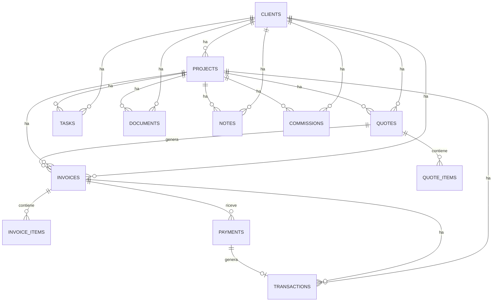

# Gestionale Professionale — Analisi Architetturale e Piano di Sviluppo

> Documento di riferimento per l'intero progetto. Nessun codice applicativo è stato ancora scritto: questa è la fase di analisi richiesta prima della FASE 1.

## Indice

1. [Analisi dei Requisiti](#1-analisi-dei-requisiti)
2. [Architettura Generale](#2-architettura-generale)
3. [Struttura delle Cartelle](#3-struttura-delle-cartelle)
4. [Schema del Database](#4-schema-del-database)
5. [Relazioni tra le Tabelle](#5-relazioni-tra-le-tabelle)
6. [Ambiguità e Decisioni Architetturali da Confermare](#6-ambiguità-e-decisioni-architetturali-da-confermare)
7. [Piano di Sviluppo per Fasi](#7-piano-di-sviluppo-per-fasi)

---

## 1. Analisi dei Requisiti

Il progetto è un gestionale mono-professionista/mono-azienda (un account = un'attività) che copre l'intero ciclo: **Cliente → Progetto → Task/Preventivo → Fattura → Pagamento → Finanze**, con Documenti, Note, Calendario, Report e Dashboard come livelli trasversali.

Fuori scope per ora (ma l'architettura è pensata per accoglierli senza refactoring pesanti):
- multi-tenant / team con più utenti sullo stesso account
- CRM avanzato, firma digitale, timer ore lavorate, automazioni complesse

Principio guida: **ogni funzionalità deve essere realmente collegata a Supabase**, nessun dato finto o hardcoded, gestione errori seria, precisione sugli importi. Questo è trattato come software di produzione, non come demo.

---

## 2. Architettura Generale

### 2.1 Stack tecnologico

Ho verificato lo stato attuale dell'ecosistema prima di fissare le scelte (siamo a settembre 2026, quindi alcune cose sono cambiate rispetto a quanto si trova comunemente nei tutorial più vecchi):

| Livello | Scelta | Note |
|---|---|---|
| Framework | **Next.js 16** (App Router) | Turbopack è ora il bundler di default. Il file `middleware.ts` è stato rinominato **`proxy.ts`** (funzione esportata `proxy` invece di `middleware`) — vedi nota di sicurezza sotto. |
| UI runtime | React 19 | — |
| Linguaggio | TypeScript (strict) | — |
| Stile | Tailwind CSS + **shadcn/ui** | shadcn/ui (basato su Radix) usa Lucide React di default: si integra perfettamente con quanto richiesto e dà tabelle, modali, dropdown, badge, toast già accessibili e coerenti, senza reinventarli da zero. |
| Backend/DB | Supabase (Postgres + Auth + Storage + RLS) | — |
| Client Supabase | **`@supabase/ssr`** | Pacchetto ufficiale attuale per SSR con Next.js (il vecchio `auth-helpers-nextjs` è deprecato). Espone `createBrowserClient` e `createServerClient`. |
| Stato server sul client | TanStack Query | Solo dove serve interattività senza reload: ricerca, filtri, aggiornamenti ottimistici (es. cambio rapido di stato di un task) |
| Tabelle dati | TanStack Table | Ricerca, ordinamento, filtri, paginazione richiesti al punto 20 |
| Form | React Hook Form + Zod (resolver) | Validazione client (UX) + server (sicurezza, mai fidarsi solo del client) |
| Grafici | Recharts | Per dashboard e report |
| Date | date-fns | — |
| Icone | Lucide React | Come richiesto |

### 2.2 Flusso dei dati e pattern architetturali

- **Lettura dati**: Server Components chiamano un livello `services/` (repository pattern) che incapsula le query Supabase. Nessun componente chiama Supabase direttamente.
- **Scrittura dati**: solo tramite **Server Actions**, che validano con Zod lato server, chiamano lo stesso livello `services/`, e invalidano la cache con `revalidatePath`/`revalidateTag`. Il nuovo modello di cache di Next.js 16 (Cache Components / direttiva `use cache`) verrà valutato nel dettaglio in fase di implementazione (Fase 4), senza che questo cambi lo schema dati o l'architettura generale.
- **Interattività client** (ricerca live, filtri su tabelle, drag&drop righe preventivo): componenti client con TanStack Query, che chiamano le stesse Server Actions o Route Handler leggeri.

### 2.3 Sicurezza

- **La sicurezza reale vive nel database**: Row Level Security su ogni tabella (`auth.uid() = user_id`), non nel frontend. È il punto centrale della sezione 18 del vostro documento e lo tratto come tale.
- **`proxy.ts`** (l'ex `middleware.ts`) viene usato **solo** per aggiornare i cookie di sessione Supabase, non come unico cancello di autorizzazione: Next.js 16 ha rinominato deliberatamente il file per chiarire che non è un confine di sicurezza affidabile da solo (c'è stato un caso reale, ampiamente documentato, di app compromesse perché l'autorizzazione viveva solo lì). Il controllo "questa pagina richiede login" viene quindi ripetuto anche nei layout/Server Component protetti, in aggiunta alla RLS. È ridondanza voluta (*defense in depth*), non uno spreco.
- Nessuna service role key lato client. Variabili d'ambiente per tutto ciò che è sensibile (`.env.local`, mai committato; `.env.example` come riferimento).
- Validazione Zod sia client che server.

### 2.4 Gestione errori (principio generale)

Le Server Action restituiscono sempre un risultato tipizzato (`{ success: true, data }` oppure `{ success: false, error: {...} }`) invece di lanciare eccezioni non gestite verso il client. Gli errori vengono categorizzati (validazione / autenticazione / database / non trovato) e tradotti in messaggi comprensibili tramite toast (componente shadcn), mai messaggi tecnici grezzi. Error boundary di Next.js per gli imprevisti non gestiti.

### 2.5 Estendibilità futura (non implementata ora, solo prevista)

- **Multi-tenant/team**: oggi ogni riga appartiene a `user_id`. Il passo naturale futuro è introdurre `organizations` e migrare `user_id` verso `organization_id` (mapping 1:1 iniziale, poi molti-a-molti con una tabella ponte membri).
- **Audit trail**: `created_at`/`updated_at` ovunque + pattern a trigger già in uso rendono semplice aggiungere in futuro una tabella `audit_log` generica senza toccare lo schema esistente.
- **PDF preventivi/fatture**: il modello dati è già completo per generarli (basterà un layer di rendering, es. `@react-pdf/renderer`), nessuna modifica allo schema necessaria.
- **Notifiche evolute, timer ore, firma digitale**: aggiunte additive (nuove tabelle collegate a `tasks`/`documents`), non richiedono di toccare le tabelle esistenti.

---

## 3. Struttura delle Cartelle

```
app/
  (auth)/
    layout.tsx              # layout minimale, non autenticato
    login/page.tsx
    registrati/page.tsx
    recupera-password/page.tsx
  (app)/
    layout.tsx               # sidebar + topbar, richiede sessione
    dashboard/page.tsx
    clienti/
      page.tsx
      [id]/page.tsx
    progetti/
      page.tsx
      [id]/page.tsx
    task/page.tsx
    calendario/page.tsx
    preventivi/
      page.tsx
      [id]/page.tsx
    fatture/
      page.tsx
      [id]/page.tsx
    finanze/page.tsx
    documenti/page.tsx
    report/page.tsx
    impostazioni/page.tsx
  proxy.ts                    # ex middleware.ts (Next.js 16): refresh sessione
  layout.tsx
  globals.css

components/
  ui/                         # primitivi shadcn (generati, non a mano)
  layout/                     # Sidebar, Topbar, MobileNav
  dashboard/                  # KpiCard, grafici dashboard
  clients/
  projects/
  tasks/
  calendar/
  quotes/
  invoices/
  finances/
  documents/
  reports/
  shared/                     # DataTable, StatusBadge, CurrencyInput, EmptyState, ConfirmDialog

lib/
  supabase/
    client.ts                 # createBrowserClient
    server.ts                 # createServerClient (Server Components/Actions)
  utils/                      # formatCurrency, formatDate, cn, ecc.
  constants/                  # stati, priorità, metodi di pagamento

services/                     # repository layer, un file per entità
  clients.service.ts
  projects.service.ts
  tasks.service.ts
  quotes.service.ts
  invoices.service.ts
  payments.service.ts
  transactions.service.ts
  documents.service.ts
  reports.service.ts

types/
  database.types.ts           # generato da `supabase gen types typescript`
  domain.ts                   # tipi applicativi derivati

schemas/                      # Zod, uno per entità
  client.schema.ts
  project.schema.ts
  ...

hooks/                        # useClients, useInvoiceTotals, ecc.

supabase/
  migrations/                 # SQL versionato (sezione 4)
  seed.sql

middleware bypassata: la protezione route è nel layout (app)/layout.tsx + proxy.ts leggero
```

Ogni cartella sotto `components/` e `services/` corrisponde 1:1 a una voce della sidebar: se in futuro serve isolare un modulo (es. estrarlo in un package separato per un secondo prodotto), il confine è già netto.

---

## 4. Schema del Database

Questo è il progetto logico completo. Diventerà migration SQL effettive, eseguite ed applicate durante la **Fase 2** (dopo la vostra approvazione).

### 4.1 Convenzioni

- `id uuid primary key default gen_random_uuid()` ovunque
- Quasi ogni tabella ha `user_id uuid references auth.users(id)`: è il proprietario dei dati e la base delle policy RLS. Includo `user_id` anche sulle tabelle "figlie" (righe preventivo/fattura), ridondante rispetto alla tabella padre ma è una pratica raccomandata da Supabase per policy RLS dirette e veloci, senza subquery.
- Importi: `numeric(12,2)` — mai `float`, per i motivi di precisione della sezione 25.
- `created_at` / `updated_at timestamptz`, con `updated_at` mantenuto da un trigger generico.
- Stati/priorità: `text` + `check` invece di `enum` nativo Postgres — più semplice da modificare in futuro (aggiungere un valore a un `enum` Postgres è scomodo; su un `check` è un `alter table`).

```sql
create extension if not exists "pgcrypto";
```

### 4.2 Tabelle

```sql
-- ================================================================
-- PROFILES — dati azienda/professionista, estende auth.users
-- ================================================================
create table profiles (
  id uuid primary key references auth.users(id) on delete cascade,
  full_name text,
  company_name text,
  vat_number text,
  tax_code text,
  address text,
  city text,
  postal_code text,
  province text,
  country text not null default 'Italia',
  phone text,
  logo_url text,
  default_vat_rate numeric(5,2) not null default 22.00,
  invoice_number_prefix text not null default '',
  quote_number_prefix text not null default '',
  created_at timestamptz not null default now(),
  updated_at timestamptz not null default now()
);

-- ================================================================
-- CLIENTI
-- ================================================================
create table clients (
  id uuid primary key default gen_random_uuid(),
  user_id uuid not null references auth.users(id) on delete cascade,
  name text not null,
  referent_name text,
  email text,
  phone text,
  vat_number text,
  tax_code text,
  address text,
  city text,
  postal_code text,
  province text,
  country text not null default 'Italia',
  notes text,
  archived_at timestamptz,                    -- soft delete, vedi sezione 6
  created_at timestamptz not null default now(),
  updated_at timestamptz not null default now()
);
create index idx_clients_user_id on clients(user_id);
create index idx_clients_search on clients using gin (to_tsvector('italian', name || ' ' || coalesce(referent_name,'')));

-- ================================================================
-- PROGETTI
-- ================================================================
create table projects (
  id uuid primary key default gen_random_uuid(),
  user_id uuid not null references auth.users(id) on delete cascade,
  client_id uuid not null references clients(id) on delete restrict,
  name text not null,
  description text,
  status text not null default 'planned'
    check (status in ('planned','in_progress','paused','completed','cancelled')),
  priority text not null default 'medium'
    check (priority in ('low','medium','high','urgent')),
  start_date date,
  expected_end_date date,
  actual_end_date date,
  budget numeric(12,2),
  project_value numeric(12,2) not null default 0,
  notes text,
  archived_at timestamptz,
  created_at timestamptz not null default now(),
  updated_at timestamptz not null default now()
);
create index idx_projects_user_id on projects(user_id);
create index idx_projects_client_id on projects(client_id);
create index idx_projects_status on projects(user_id, status);

-- ================================================================
-- TASK
-- ================================================================
create table tasks (
  id uuid primary key default gen_random_uuid(),
  user_id uuid not null references auth.users(id) on delete cascade,
  project_id uuid references projects(id) on delete cascade,
  client_id uuid references clients(id) on delete set null,
  title text not null,
  description text,
  status text not null default 'todo'
    check (status in ('todo','in_progress','in_review','completed')),
  priority text not null default 'medium'
    check (priority in ('low','medium','high','urgent')),
  due_date date,
  notes text,
  created_at timestamptz not null default now(),
  updated_at timestamptz not null default now()
);
create index idx_tasks_user_id on tasks(user_id);
create index idx_tasks_project_id on tasks(project_id);
create index idx_tasks_due on tasks(user_id, due_date) where status <> 'completed';

-- ================================================================
-- EVENTI CALENDARIO — solo eventi custom.
-- Le scadenze di task/fatture/progetti NON sono duplicate qui:
-- il calendario le legge dalle tabelle originali via query.
-- ================================================================
create table events (
  id uuid primary key default gen_random_uuid(),
  user_id uuid not null references auth.users(id) on delete cascade,
  title text not null,
  description text,
  event_date date not null,
  event_time time,
  event_type text not null default 'other'
    check (event_type in ('meeting','reminder','other')),
  client_id uuid references clients(id) on delete set null,
  project_id uuid references projects(id) on delete set null,
  task_id uuid references tasks(id) on delete set null,
  created_at timestamptz not null default now(),
  updated_at timestamptz not null default now()
);
create index idx_events_user_date on events(user_id, event_date);

-- ================================================================
-- CONTATORI NUMERAZIONE — per preventivi e fatture progressivi
-- ================================================================
create table document_counters (
  user_id uuid not null references auth.users(id) on delete cascade,
  document_type text not null check (document_type in ('quote','invoice')),
  year integer not null,
  last_number integer not null default 0,
  primary key (user_id, document_type, year)
);

-- ================================================================
-- PREVENTIVI
-- ================================================================
create table quotes (
  id uuid primary key default gen_random_uuid(),
  user_id uuid not null references auth.users(id) on delete cascade,
  client_id uuid not null references clients(id) on delete restrict,
  project_id uuid references projects(id) on delete set null,
  quote_number text not null,
  issue_date date not null default current_date,
  expiry_date date,
  status text not null default 'draft'
    check (status in ('draft','sent','accepted','rejected','expired')),
  subtotal numeric(12,2) not null default 0,   -- cache calcolata dalle righe (trigger)
  vat_amount numeric(12,2) not null default 0,
  total numeric(12,2) not null default 0,
  notes text,
  created_at timestamptz not null default now(),
  updated_at timestamptz not null default now(),
  unique (user_id, quote_number)
);
create index idx_quotes_user_id on quotes(user_id);
create index idx_quotes_client_id on quotes(client_id);
create index idx_quotes_status on quotes(user_id, status);

create table quote_items (
  id uuid primary key default gen_random_uuid(),
  user_id uuid not null references auth.users(id) on delete cascade,
  quote_id uuid not null references quotes(id) on delete cascade,
  description text not null,
  quantity numeric(10,2) not null default 1 check (quantity > 0),
  unit_price numeric(12,2) not null default 0 check (unit_price >= 0),
  discount_percent numeric(5,2) not null default 0 check (discount_percent between 0 and 100),
  vat_rate numeric(5,2) not null default 22.00 check (vat_rate >= 0),  -- 0 ammesso: regime forfettario
  line_total numeric(12,2) not null default 0,  -- imponibile di riga, calcolato
  sort_order integer not null default 0,
  created_at timestamptz not null default now()
);
create index idx_quote_items_quote_id on quote_items(quote_id);

-- ================================================================
-- FATTURE
-- ================================================================
create table invoices (
  id uuid primary key default gen_random_uuid(),
  user_id uuid not null references auth.users(id) on delete cascade,
  client_id uuid not null references clients(id) on delete restrict,
  project_id uuid references projects(id) on delete set null,
  quote_id uuid references quotes(id) on delete set null,
  invoice_number text not null,
  issue_date date not null default current_date,
  due_date date,
  status text not null default 'draft'
    check (status in ('draft','issued','partially_paid','paid','overdue','cancelled')),
  subtotal numeric(12,2) not null default 0,
  vat_amount numeric(12,2) not null default 0,
  total numeric(12,2) not null default 0,
  paid_amount numeric(12,2) not null default 0,          -- sincronizzato da trigger sui pagamenti
  remaining_amount numeric(12,2) generated always as (total - paid_amount) stored,
  notes text,
  created_at timestamptz not null default now(),
  updated_at timestamptz not null default now(),
  unique (user_id, invoice_number)
);
create index idx_invoices_user_id on invoices(user_id);
create index idx_invoices_client_id on invoices(client_id);
create index idx_invoices_status on invoices(user_id, status);
create index idx_invoices_due on invoices(user_id, due_date) where status not in ('paid','cancelled');

create table invoice_items (
  id uuid primary key default gen_random_uuid(),
  user_id uuid not null references auth.users(id) on delete cascade,
  invoice_id uuid not null references invoices(id) on delete cascade,
  description text not null,
  quantity numeric(10,2) not null default 1 check (quantity > 0),
  unit_price numeric(12,2) not null default 0 check (unit_price >= 0),
  discount_percent numeric(5,2) not null default 0 check (discount_percent between 0 and 100),
  vat_rate numeric(5,2) not null default 22.00 check (vat_rate >= 0),
  line_total numeric(12,2) not null default 0,
  sort_order integer not null default 0,
  created_at timestamptz not null default now()
);
create index idx_invoice_items_invoice_id on invoice_items(invoice_id);

-- ================================================================
-- PAGAMENTI
-- ================================================================
create table payments (
  id uuid primary key default gen_random_uuid(),
  user_id uuid not null references auth.users(id) on delete cascade,
  invoice_id uuid not null references invoices(id) on delete cascade,
  amount numeric(12,2) not null check (amount > 0),
  payment_date date not null default current_date,
  payment_method text not null default 'bank_transfer'
    check (payment_method in ('bank_transfer','card','cash','paypal','other')),
  notes text,
  created_at timestamptz not null default now(),
  updated_at timestamptz not null default now()
);
create index idx_payments_invoice_id on payments(invoice_id);
create index idx_payments_user_id on payments(user_id);

-- ================================================================
-- CATEGORIE TRANSAZIONI — tabella dedicata, vedi sezione 6
-- ================================================================
create table transaction_categories (
  id uuid primary key default gen_random_uuid(),
  user_id uuid not null references auth.users(id) on delete cascade,
  name text not null,
  type text not null check (type in ('income','expense')),
  is_default boolean not null default false,
  created_at timestamptz not null default now(),
  unique (user_id, name, type)
);

-- ================================================================
-- TRANSAZIONI — registro unico di entrate/uscite (il "libro mastro")
-- ================================================================
create table transactions (
  id uuid primary key default gen_random_uuid(),
  user_id uuid not null references auth.users(id) on delete cascade,
  type text not null check (type in ('income','expense')),
  category_id uuid references transaction_categories(id) on delete set null,
  description text,
  amount numeric(12,2) not null check (amount > 0),   -- il segno lo dà "type", non il numero
  transaction_date date not null default current_date,
  client_id uuid references clients(id) on delete set null,
  project_id uuid references projects(id) on delete set null,
  invoice_id uuid references invoices(id) on delete set null,
  payment_id uuid references payments(id) on delete cascade,  -- valorizzato se auto-generata da un pagamento
  payment_method text,
  notes text,
  created_at timestamptz not null default now(),
  updated_at timestamptz not null default now()
);
create index idx_transactions_user_date on transactions(user_id, transaction_date);
create index idx_transactions_type on transactions(user_id, type);
create unique index idx_transactions_payment_id on transactions(payment_id) where payment_id is not null;

-- ================================================================
-- COMMISSIONI
-- ================================================================
create table commissions (
  id uuid primary key default gen_random_uuid(),
  user_id uuid not null references auth.users(id) on delete cascade,
  description text not null,
  amount numeric(12,2) not null check (amount >= 0),
  percentage numeric(5,2),
  commission_date date not null default current_date,
  client_id uuid references clients(id) on delete set null,
  project_id uuid references projects(id) on delete set null,
  status text not null default 'to_pay' check (status in ('to_pay','paid')),
  transaction_id uuid references transactions(id) on delete set null,
  created_at timestamptz not null default now(),
  updated_at timestamptz not null default now()
);
create index idx_commissions_user_id on commissions(user_id);

-- ================================================================
-- DOCUMENTI — Supabase Storage, FK dirette (non associazione polimorfica)
-- ================================================================
create table documents (
  id uuid primary key default gen_random_uuid(),
  user_id uuid not null references auth.users(id) on delete cascade,
  file_name text not null,
  storage_path text not null,
  mime_type text,
  file_size bigint,
  client_id uuid references clients(id) on delete cascade,
  project_id uuid references projects(id) on delete cascade,
  quote_id uuid references quotes(id) on delete cascade,
  invoice_id uuid references invoices(id) on delete cascade,
  created_at timestamptz not null default now()
);
create index idx_documents_user_id on documents(user_id);
create index idx_documents_client_id on documents(client_id);
create index idx_documents_project_id on documents(project_id);

-- ================================================================
-- NOTE — log cronologico multiplo su Cliente/Progetto
-- (diverso dal campo "note" singolo già presente sulle altre tabelle)
-- ================================================================
create table notes (
  id uuid primary key default gen_random_uuid(),
  user_id uuid not null references auth.users(id) on delete cascade,
  content text not null,
  client_id uuid references clients(id) on delete cascade,
  project_id uuid references projects(id) on delete cascade,
  created_at timestamptz not null default now(),
  updated_at timestamptz not null default now()
);
create index idx_notes_client_id on notes(client_id);
create index idx_notes_project_id on notes(project_id);
```

### 4.3 Viste utili (esempi — altre verranno aggiunte per dashboard/report)

Nota: create con `security_invoker = true` (Postgres 15+, disponibile su Supabase), altrimenti una vista rischia di bypassare la RLS della tabella sottostante.

```sql
-- Costi e profitto di progetto: MAI salvati come colonna statica,
-- sempre calcolati dalle transazioni collegate (sezione 6)
create view project_financials
with (security_invoker = true) as
select
  p.id as project_id,
  p.project_value,
  coalesce(sum(t.amount) filter (where t.type = 'expense'), 0) as costs_incurred,
  p.project_value - coalesce(sum(t.amount) filter (where t.type = 'expense'), 0) as profit
from projects p
left join transactions t on t.project_id = p.id
group by p.id, p.project_value;

-- Totali cliente per la pagina di dettaglio (sezione 5)
create view client_financials
with (security_invoker = true) as
select
  c.id as client_id,
  coalesce(sum(i.total) filter (where i.status <> 'cancelled'), 0) as total_invoiced,
  coalesce(sum(i.paid_amount) filter (where i.status <> 'cancelled'), 0) as total_collected,
  coalesce(sum(i.remaining_amount) filter (where i.status <> 'cancelled'), 0) as total_outstanding
from clients c
left join invoices i on i.client_id = c.id
group by c.id;
```

### 4.4 Trigger principali

| Trigger | Su | Fa cosa |
|---|---|---|
| `set_updated_at` | tutte le tabelle con `updated_at` | Aggiorna `updated_at = now()` a ogni `update` |
| `recalc_quote_totals` | `quote_items` (insert/update/delete) | Ricalcola `subtotal`/`vat_amount`/`total` sul preventivo padre |
| `recalc_invoice_totals` | `invoice_items` (insert/update/delete) | Idem per la fattura padre |
| `sync_invoice_payment` | `payments` (insert/update/delete) | Ricalcola `invoices.paid_amount` (somma pagamenti) e aggiorna `status` (`paid`/`partially_paid`) |
| `create_transaction_from_payment` | `payments` (insert) | Genera automaticamente la riga in `transactions` — vedi sotto |

Lo stato **"scaduta"** (fattura/preventivo) non è mai scritto da un trigger: si calcola a runtime confrontando `due_date`/`expiry_date` con la data odierna, perché dipende dal passare del tempo — un valore scritto una volta diventerebbe stantio senza un job schedulato.

Esempio completo del trigger più importante dal punto di vista di business logic (collega Pagamenti e Finanze):

```sql
create or replace function fn_create_transaction_from_payment()
returns trigger as $$
declare
  v_invoice invoices%rowtype;
begin
  select * into v_invoice from invoices where id = new.invoice_id;

  insert into transactions (
    user_id, type, description, amount, transaction_date,
    client_id, project_id, invoice_id, payment_id, payment_method
  ) values (
    new.user_id, 'income',
    'Incasso fattura ' || v_invoice.invoice_number,
    new.amount, new.payment_date,
    v_invoice.client_id, v_invoice.project_id, new.invoice_id, new.id,
    new.payment_method
  );
  return new;
end;
$$ language plpgsql security definer;

create trigger trg_create_transaction_from_payment
  after insert on payments
  for each row execute function fn_create_transaction_from_payment();
```

### 4.5 Row Level Security

Pattern identico su **tutte** le tabelle sopra (quattro policy per select/insert/update/delete):

```sql
alter table clients enable row level security;

create policy "clients_select_own" on clients
  for select using (auth.uid() = user_id);
create policy "clients_insert_own" on clients
  for insert with check (auth.uid() = user_id);
create policy "clients_update_own" on clients
  for update using (auth.uid() = user_id) with check (auth.uid() = user_id);
create policy "clients_delete_own" on clients
  for delete using (auth.uid() = user_id);
```

Si applica identico a `projects, tasks, events, quotes, quote_items, invoices, invoice_items, payments, transaction_categories, transactions, commissions, documents, notes, document_counters` (su `profiles` la colonna di riferimento è `id` invece di `user_id`). Avendo `user_id` diretto anche sulle righe (`quote_items`, `invoice_items`), nessuna policy richiede una subquery/join: restano tutte semplici e veloci.

---

## 5. Relazioni tra le Tabelle



*(Ogni tabella include anche `user_id`, omesso dal diagramma perché presente ovunque e non aggiunge informazione.)*

Il flusso "canonico" dei dati: un **Cliente** ha uno o più **Progetti**; da un Progetto (o direttamente da un Cliente) nasce un **Preventivo** con le sue righe; se accettato, genera una **Fattura** con le sue righe; la Fattura riceve uno o più **Pagamenti** (anche parziali); ogni Pagamento genera automaticamente una **Transazione** di tipo entrata. Le uscite (costi, software, fornitori...) si registrano come Transazioni manuali, collegate opzionalmente a Cliente/Progetto/Fattura. Dashboard, Finanze e Report leggono sempre da `transactions` come fonte unica per entrate/uscite.

---

## 6. Ambiguità e Decisioni Architetturali da Confermare

**Modello dati**
- Ho aggiunto la tabella `profiles` (non nominata esplicitamente da voi) per i dati azienda/professionista necessari a intestare preventivi/fatture (ragione sociale, P.IVA, aliquota IVA di default, prefissi numerazione).

**Calcoli finanziari**
- Subtotale/IVA/Totale di preventivi e fatture: calcolati dalle righe e **cachati** sulla tabella padre, sincronizzati da trigger — mai da ricalcolare a ogni lettura, ma sempre coerenti.
- Costi e profitto di progetto: **mai** salvati come colonna, sempre calcolati dalla vista `project_financials` sommando le transazioni di tipo uscita collegate. Stesso principio per "scaduta" (calcolata dalla data, non salvata).
- Ogni pagamento su fattura genera **automaticamente** una transazione entrata collegata (trigger), così Finanze/Dashboard leggono da un'unica fonte invece di dover unire due tabelle.

**Struttura di alcune entità**
- Task: collegabile a Cliente e Progetto **in modo indipendente** (non derivato automaticamente l'uno dall'altro) — permette task legati solo a un cliente, senza progetto specifico.
- "Note": interpretate come due cose — un campo `note` di testo libero già presente su quasi ogni entità (per annotazioni rapide), **più** una tabella `notes` dedicata per un log cronologico di note multiple e datate su Clienti/Progetti.
- Categorie entrate/uscite: proposta una tabella `transaction_categories` (pre-popolata con le vostre categorie) invece di un elenco fisso, per poterle personalizzare in futuro dalle Impostazioni. Alternativa più semplice disponibile: elenco fisso via `check`.
- Sconto sulle righe: assunto in **percentuale**, non importo fisso.
- Priorità progetto: non erano specificati i valori nel documento originale — ho riusato gli stessi 4 livelli dei task (Bassa/Media/Alta/Urgente).
- Aggiunto un riferimento opzionale preventivo → fattura (`quote_id` su `invoices`) per tracciare la provenienza, utile nei report.

**Eliminazioni e integrità storica**
- Per Clienti e Progetti, "elimina" in interfaccia farà un **soft-delete** (`archived_at`) invece di una cancellazione fisica, per non perdere lo storico di fatture/pagamenti collegato. La cancellazione fisica resta possibile solo se non esistono record collegati.
- Preventivi/Fatture: una volta usciti dallo stato Bozza, non saranno più eliminabili fisicamente ma solo annullabili (cambio di stato), per preservare la sequenza di numerazione. Le bozze restano eliminabili liberamente.

**Numerazione documenti**
- Preventivi e fatture: numerazione progressiva per utente/anno (tabella `document_counters`, generazione atomica per evitare duplicati). Formato proposto: `AAAA-NNNN` (es. `2026-0001`), prefisso personalizzabile dalle Impostazioni — fatemi sapere se avete un formato specifico in mente.

**Notifiche**
- Per ora calcolate "al volo" da query sulle scadenze esistenti, non salvate in una tabella dedicata: evita complessità non richiesta (stato letto/non letto, invio push), aggiungibile in futuro con una tabella `notifications`.

Sono tutte scelte facilmente reversibili in questa fase, prima che venga scritta una riga di migration.

---

## 7. Piano di Sviluppo per Fasi

**Fase 1 — Setup del progetto**
Next.js 16 (App Router, Turbopack) + TypeScript + Tailwind, shadcn/ui, struttura cartelle, connessione Supabase (`@supabase/ssr`), variabili d'ambiente, lint/format.

**Fase 2 — Database**
Migration SQL per tutte le tabelle, RLS + policy, trigger, viste, generazione tipi TypeScript da Supabase, seed di dati di esempio (clienti, progetti, task, preventivi, fatture, pagamenti, entrate, uscite).

**Fase 3 — Autenticazione**
Login / registrazione / recupero password, trigger creazione automatica `profiles`, `proxy.ts` per refresh sessione + controllo autorizzazione nei layout protetti, pagina Impostazioni base.

**Fase 4 — Layout & Dashboard**
Sidebar responsive (drawer su mobile) + topbar, dashboard con KPI, grafici (entrate/uscite/profitto nel tempo, entrate vs uscite, distribuzione progetti per stato), attività recenti, scadenze, task urgenti, pagamenti recenti.

**Fase 5 — Clienti**
CRUD, ricerca/filtri, pagina dettaglio con tab (progetti, preventivi, fatture, pagamenti, documenti, note) e totali finanziari (da `client_financials`).

**Fase 6 — Progetti**
CRUD, stati/priorità, pagina dettaglio con progresso/task/scadenze/documenti/preventivi/fatture/costi/profitto (da `project_financials`).

**Fase 7 — Task & Calendario**
CRUD task, cambio stato rapido, filtri/ordinamento; vista calendario che aggrega scadenze task/fatture/progetti + eventi custom.

**Fase 8 — Preventivi**
CRUD con righe voce dinamiche, calcolo automatico imponibile/IVA/totale, numerazione progressiva, cambio stato.

**Fase 9 — Fatture & Pagamenti**
CRUD fattura con righe, numerazione progressiva, registrazione pagamenti anche parziali, aggiornamento automatico stato/residuo, vista scadute.

**Fase 10 — Finanze & Commissioni**
Entrate/uscite manuali con categorie, gestione commissioni, viste aggregate.

**Fase 11 — Documenti**
Upload/download/eliminazione su Supabase Storage, collegamento a cliente/progetto/preventivo/fattura, validazione tipo/dimensione, gestione errori.

**Fase 12 — Report**
Filtri per periodo/cliente/progetto/categoria; grafici e tabelle su fatturato, entrate, uscite, profitto, fatture pagate/non pagate/scadute, redditività progetti.

**Fase 13 — Rifinitura**
Notifiche interne (calcolate a runtime), gestione errori globale, test responsive completo, review sicurezza (RLS, env), ottimizzazione query, polish UI/UX.

Dopo ogni fase: verifica del codice, dei tipi TypeScript, delle query Supabase e delle relazioni database prima di passare alla successiva — come richiesto.
